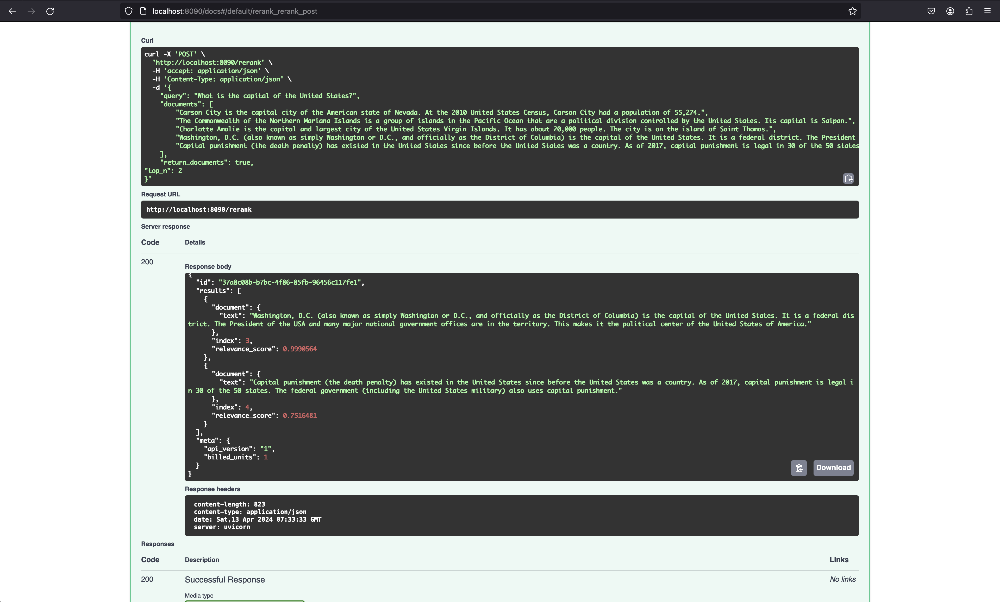
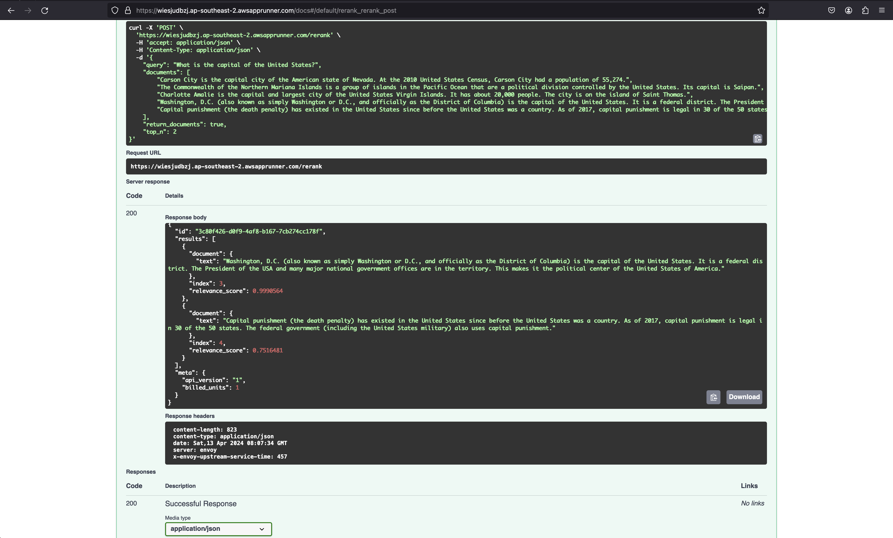

# Welcome to the CDK TypeScript Project

This project is designed to provide a robust template for developing cloud infrastructure using the AWS Cloud Development Kit (CDK) with TypeScript to deploy a fast, secure and cost efficient cohere rerank services on AWS with AppRunner. It includes setup for local development with Docker and deployment instructions using the AWS CDK CLI.

## Project Setup

### Prerequisites

Before you begin, ensure you have the following installed:

- Node.js and npm
- Docker
- AWS CLI
- AWS CDK

### Installing Dependencies

Run the following command to install the necessary Node.js packages:

```bash
npm install
```

### Setting up AWS Credentials

Configure your AWS CLI with the appropriate credentials:

```bash
aws configure
```

### Local Development with Docker

To set up a local development environment with Docker, use the following commands:

```bash
docker build -t cdk-app .
docker run -p 8090:8090 cdk-app
```

## Deployment

Deploy your CDK stack to AWS with the following command:

```bash
npx cdk deploy
```

This command deploys the CDK stack defined in your application to your default AWS account and region. Ensure your AWS credentials are set up correctly.

## Useful Commands

- `npm run build`   compile TypeScript to JS
- `npm run watch`   watch for changes and compile
- `npm run test`    perform the Jest unit tests
- `npx cdk deploy`  deploy this stack to your default AWS account/region
- `npx cdk diff`    compare deployed stack with current state
- `npx cdk synth`   emits the synthesized CloudFormation template

This is a blank project for CDK development with TypeScript.

The `cdk.json` file tells the CDK Toolkit how to execute your app.

## Demo

### Local Demo with Docker

To see a demo of the service running locally with Docker, refer to the screenshot below:



### AWS App Runner Demo

After deploying the service on AWS with App Runner, you can see the demo as shown in the screenshot below:



## Setup Environment

To configure your environment variables for local development and deployment, follow these steps:

## Deploying from Repository

You can deploy the stack from the following repository: [AWS VPC Creator](https://github.com/SofarDatas/aws-vpc-creator). After deployment, you can use the VPC_ID obtained from there as an input parameter.


1. Copy the `.env.example` file to a new file named `.env`:

   ```bash
   cp .env.example .env
   ```

2. Open the `.env` file in a text editor and fill in the necessary values for the environment variables. This file will not be tracked by git, so your sensitive information will remain secure.

3. Save the changes to the `.env` file. The application will automatically use these settings when running locally or when deployed.

Make sure to never commit your `.env` file to version control to keep sensitive keys and settings confidential.
